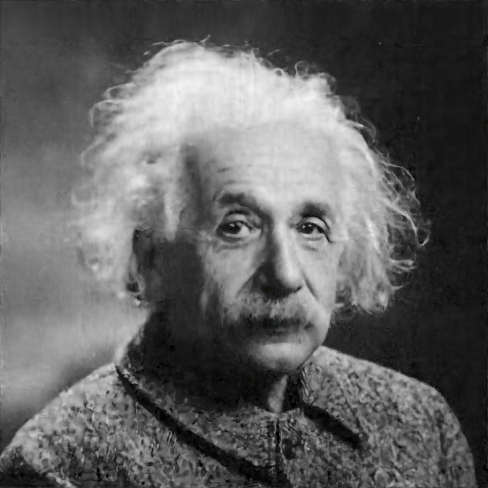

# Tiny CUDA Neural Networks 

This is a small, self-contained framework for training and querying neural networks. Most notably, it contains a lightning fast "fully fused" multi-layer perceptron as well as support for various advanced input encodings, losses, and optimizers.

## License and Citation

This framework is licensed under the BSD 3-clause license. Please see `LICENSE.txt` for details.

If you use it in your research, we would appreciate a citation via
```bibtex
@misc{tiny-cuda-nn,
    Author = {Thomas M\"uller},
    Year = {2021},
    Note = {https://github.com/nvlabs/tiny-cuda-nn},
    Title = {Tiny {CUDA} Neural Network Framework}
}
```

For business inquiries, please visit our website and submit the form: [NVIDIA Research Licensing](https://www.nvidia.com/en-us/research/inquiries/)


## Performance


_Fully fused networks vs. TensorFlow v2.5.0 w/ XLA. Measured on 64 (solid line) and 128 (dashed line) neurons wide multi-layer perceptrons on an RTX 3090. Generated by `benchmarks/bench_ours.cu` and `benchmarks/bench_tensorflow.py`._


## Publications

This framework powers the following publications:

> __Instant Neural Graphics Primitives with a Multiresolution Hash Encoding__  
> [Thomas Müller](https://tom94.net), [Alex Evans](https://research.nvidia.com/person/alex-evans), [Christoph Schied](https://research.nvidia.com/person/christoph-schied), [Alexander Keller](https://research.nvidia.com/person/alex-keller)  
> _arXiv [cs.GR], Jan 2022_  
> __[ [Website](https://nvlabs.github.io/instant-ngp/) ] [ [Paper](https://nvlabs.github.io/instant-ngp/assets/mueller2022instant.pdf) ] [ [Code](https://github.com/NVlabs/instant-ngp) ] [ [Video](https://nvlabs.github.io/instant-ngp/assets/mueller2022instant.mp4) ]__

> __Real-time Neural Radiance Caching for Path Tracing__  
> [Thomas Müller](https://tom94.net), [Fabrice Rousselle](https://research.nvidia.com/person/fabrice-rousselle), [Jan Novák](http://jannovak.info), [Alexander Keller](https://research.nvidia.com/person/alex-keller)  
> _ACM Transactions on Graphics (Proceedings of SIGGRAPH), vol. 40, no. 4, pp. 36:1–36:16, Aug 2021_  
> __[ [Paper](https://tom94.net/data/publications/mueller21realtime/mueller21realtime.pdf) ] [ [GTC talk](https://gtc21.event.nvidia.com/media/Fully%20Fused%20Neural%20Network%20for%20Radiance%20Caching%20in%20Real%20Time%20Rendering%20%5BE31307%5D/1_liqy6k1c) ] [ [Video](https://tom94.net/data/publications/mueller21realtime/mueller21realtime.mp4) ] [ [Interactive Results Viewer](https://tom94.net/data/publications/mueller21realtime/interactive-viewer/) ] [ [BibTeX](https://tom94.net/data/publications/mueller21realtime/mueller21realtime.bib) ]__

> __Extracting Triangular 3D Models, Materials, and Lighting From Images__  
> [Jacob Munkberg](https://research.nvidia.com/person/jacob-munkberg), [Jon Hasselgren](https://research.nvidia.com/person/jon-hasselgren), [Tianchang Shen](http://www.cs.toronto.edu/~shenti11/), [Jun Gao](http://www.cs.toronto.edu/~jungao/), [Wenzheng Chen](http://www.cs.toronto.edu/~wenzheng/), [Alex Evans](https://research.nvidia.com/person/alex-evans), [Thomas Müller](https://tom94.net), [Sanja Fidler](https://www.cs.toronto.edu/~fidler/)  
> _[arXiv:2111.12503 [cs.CV]](https://arxiv.org/abs/2111.12503)_, Nov 2021  
> __[ [Website](https://nvlabs.github.io/nvdiffrec/) ] [ [Paper](https://nvlabs.github.io/nvdiffrec/assets/paper.pdf) ] [ [Video](https://nvlabs.github.io/nvdiffrec/assets/video.mp4) ] [ [BibTeX](https://nvlabs.github.io/nvdiffrec/assets/bib.txt) ]__

## Usage

Tiny CUDA neural networks have a simple C++/CUDA API:

```cpp
#include <tiny-cuda-nn/common.h>

// Configure the model
nlohmann::json config = {
	{"loss", {
		{"otype", "L2"}
	}},
	{"optimizer", {
		{"otype", "Adam"},
		{"learning_rate", 1e-3},
	}},
	{"encoding", {
		{"otype", "OneBlob"},
		{"n_bins", 32},
	}},
	{"network", {
		{"otype", "FullyFusedMLP"},
		{"n_neurons", 64},
		{"n_hidden_layers", 5},
		{"activation", "ReLU"},
		{"output_activation", "None"},
	}},
};

using namespace tcnn;

auto model = create_from_config(n_input_dims, n_output_dims, config);

// Train the model
GPUMatrix<float> training_batch_inputs(n_input_dims, batch_size);
GPUMatrix<float> training_batch_targets(n_output_dims, batch_size);

for (int i = 0; i < n_training_steps; ++i) {
	generate_training_batch(&training_batch_inputs, &training_batch_targets); // <-- your code

	float loss;
	model.trainer->training_step(training_batch_inputs, training_batch_targets, &loss);
	std::cout << "iteration=" << i << " loss=" << loss << std::endl;
}

// Use the model
GPUMatrix<float> inference_inputs(n_input_dims, batch_size);
generate_inputs(&inference_inputs); // <-- your code

GPUMatrix<float> inference_outputs(n_output_dims, batch_size);
model.network->inference(inference_inputs, inference_outputs);
```


## Example: learning a 2D image

We provide a sample application where an image function _(x,y) -> (R,G,B)_ is learned. It can be run via
```sh
tiny-cuda-nn/build> ./mlp_learning_an_image ../data/images/albert.exr ../data/config.json
```
producing an image every 1000 training steps. Each 1000 steps should take roughly 0.8 seconds with the default configuration on an RTX 3090.

| Learned image after 1,000 steps | Learned image after 10,000 steps | Reference image |
|:---:|:---:|:---:|
|  |  |  |


## Requirements

- CUDA __v10.2 or higher__.
- CMake __v3.18 or higher__.
- A __C++14__ capable compiler.
- A high-end NVIDIA GPU that supports TensorCores and has a large amount of shared memory. The framework was tested primarily with an RTX 3090.
- The fully fused MLP component of this framework requires a __very large__ amount of shared memory in its default configuration. It will likely only work on an RTX 3090, an RTX 2080 Ti, or high-end enterprise GPUs. Lower end cards must reduce the `n_neurons` parameter or use the `CutlassMLP` (better compatibility but slower) instead.

## Compilation

Begin by cloning this repository and all its submodules using the following command:
```sh
$ git clone --recursive https://github.com/nvlabs/tiny-cuda-nn
$ cd tiny-cuda-nn
```

Then, use CMake to generate build files:

```sh
tiny-cuda-nn$ mkdir build
tiny-cuda-nn$ cd build
tiny-cuda-nn/build$ cmake ..
```

The last step differs by operating system.
- Windows: open `tiny-cuda-nn/build/tiny-cuda-nn.sln` in Visual Studio and click the "Build" button.
- Linux: run the command
  ```sh
  tiny-cuda-nn/build$ make -j
  ```

## Components

The following is a summary of all components of this framework that are currently released. Please consult [the JSON documentation](DOCUMENTATION.md) for how to configure them.


| Networks | &nbsp; | &nbsp;
| :--- | :---------- | :-----
| Fully fused MLP | `src/fully_fused_mlp.cu` | Lightning fast implementation of small multi-layer perceptrons (MLPs).
| CUTLASS MLP     | `src/cutlass_mlp.cu`     | MLP based on [CUTLASS](https://github.com/NVIDIA/cutlass)' GEMM routines. Slower than fully-fused, but handles larger networks and still is reasonably fast.
| CUTLASS ResNet  | `src/cutlass_resnet.cu`  | Fully connected residual network based on CUTLASS' GEMM routines.

| Input encodings | &nbsp; | &nbsp;
| :--- | :---------- | :-----
| Composite | `include/tiny-cuda-nn/encodings/composite.h` | Allows composing multiple encodings. Can be, for example, used to assemble the Neural Radiance Caching encoding [[Müller et al. 2021]](https://tom94.net/).
| Frequency | `include/tiny-cuda-nn/encodings/frequency.h` | NeRF's [[Mildenhall et al. 2020]](https://www.matthewtancik.com/nerf) positional encoding applied equally to all dimensions.
| Grid | `include/tiny-cuda-nn/encodings/grid.h` | Encoding based on trainable multiresolution grids. Used for [Instant Neural Graphics Primitives [Müller et al. 2022]](https://nvlabs.github.io/instant-ngp/). The grids can be backed by hashtables, dense storage, or tiled storage.
| Identity | `include/tiny-cuda-nn/encodings/identity.h` | Leaves values untouched.
| Oneblob | `include/tiny-cuda-nn/encodings/oneblob.h` | From Neural Importance Sampling [[Müller et al. 2019]](https://tom94.net/data/publications/mueller18neural/mueller18neural-v4.pdf) and Neural Control Variates [[Müller et al. 2020]](https://tom94.net/data/publications/mueller20neural/mueller20neural.pdf).
| SphericalHarmonics | `include/tiny-cuda-nn/encodings/spherical_harmonics.h` | A frequency-space encoding that is more suitable to direction vectors than component-wise ones.
| TriangleWave | `include/tiny-cuda-nn/encodings/triangle_wave.h` | Low-cost alternative to the NeRF's encoding. Used in Neural Radiance Caching [[Müller et al. 2021]](https://tom94.net/).

| Losses | &nbsp; | &nbsp;
| :--- | :---------- | :-----
| L1 | `include/tiny-cuda-nn/losses/l1.h` | Standard L1 loss.
| Relative L1 | `include/tiny-cuda-nn/losses/l1.h` | Relative L1 loss normalized by the network prediction.
| MAPE | `include/tiny-cuda-nn/losses/mape.h` | Mean absolute percentage error (MAPE). The same as Relative L1, but normalized by the target.
| SMAPE | `include/tiny-cuda-nn/losses/smape.h` | Symmetric mean absolute percentage error (SMAPE). The same as Relative L1, but normalized by the mean of the prediction and the target.
| L2 | `include/tiny-cuda-nn/losses/l2.h` | Standard L2 loss.
| Relative L2 | `include/tiny-cuda-nn/losses/relative_l2.h` | Relative L2 loss normalized by the network prediction [[Lehtinen et al. 2018]](https://github.com/NVlabs/noise2noise).
| Relative L2 Luminance | `include/tiny-cuda-nn/losses/relative_l2_luminance.h` | Same as above, but normalized by the luminance of the network prediction. Only applicable when network prediction is RGB. Used in Neural Radiance Caching [[Müller et al. 2021]](https://tom94.net/).
| Cross Entropy | `include/tiny-cuda-nn/losses/cross_entropy.h` | Standard cross entropy loss. Only applicable when the network prediction is a PDF.
| Variance | `include/tiny-cuda-nn/losses/variance_is.h` | Standard variance loss. Only applicable when the network prediction is a PDF.

| Optimizers | &nbsp; | &nbsp;
| :--- | :---------- | :-----
| Adam | `include/tiny-cuda-nn/optimizers/adam.h` | Implementation of Adam [[Kingma and Ba 2014]](https://arxiv.org/abs/1412.6980), generalized to AdaBound [[Luo et al. 2019]](https://github.com/Luolc/AdaBound).
| Novograd | `include/tiny-cuda-nn/optimizers/lookahead.h` | Implementation of Novograd [[Ginsburg et al. 2019]](https://arxiv.org/abs/1905.11286).
| SGD | `include/tiny-cuda-nn/optimizers/sgd.h` | Standard stochastic gradient descent (SGD).
| Shampoo | `include/tiny-cuda-nn/optimizers/shampoo.h` | Implementation of the 2nd order Shampoo optimizer [[Gupta et al. 2018]](https://arxiv.org/abs/1802.09568) with home-grown optimizations as well as those by [Anil et al. [2020]](https://arxiv.org/abs/2002.09018).
| Average | `include/tiny-cuda-nn/optimizers/average.h` | Wraps another optimizer and computes a linear average of the weights over the last N iterations. The average is used for inference only (does not feed back into training).
| Batched | `include/tiny-cuda-nn/optimizers/batched.h` | Wraps another optimizer, invoking the nested optimizer once every N steps on the averaged gradient. Has the same effect as increasing the batch size but requires only a constant amount of memory. |
| EMA | `include/tiny-cuda-nn/optimizers/average.h` | Wraps another optimizer and computes an exponential moving average of the weights. The average is used for inference only (does not feed back into training).
| Exponential Decay | `include/tiny-cuda-nn/optimizers/exponential_decay.h` | Wraps another optimizer and performs piecewise-constant exponential learning-rate decay.
| Lookahead | `include/tiny-cuda-nn/optimizers/lookahead.h` | Wraps another optimizer, implementing the lookahead algorithm [[Zhang et al. 2019]](https://arxiv.org/abs/1907.08610).


## Acknowledgments

Special thanks go to the NRC authors for helpful discussions and to [Nikolaus Binder](https://research.nvidia.com/person/nikolaus-binder) for providing part of the infrastructure of this framework, as well as for help with utilizing TensorCores from within CUDA.
